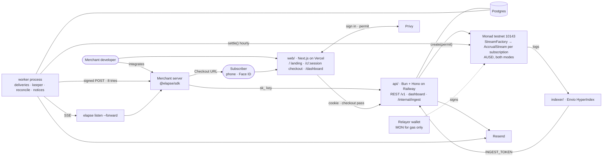
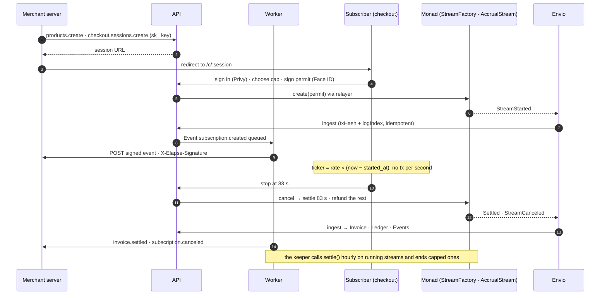

# Elapse

**You only pay what elapsed.**

Per-second subscriptions on Monad: protocol, merchant SDK, docs, and signed webhooks. Cancel at 83 seconds, pay 83 seconds. Your server finds out via webhook — not a cron job.

Track 2 · Monad Metropolis · Consumer Products & Payments. Submission 13 October 2026.

## Hosted

| What | Where |
|---|---|
| App: landing, hosted checkout, merchant dashboard | https://elapse.finance |
| API | https://api.elapse.finance (`GET /v1/status` is public) |
| Docs | https://docs.elapse.finance — start at the Quickstart |
| SDK | `npm install @elapse/sdk` (0.1.3, Node 20+) |
| CLI | `npx @elapse/cli listen --forward http://localhost:3000/webhooks` (0.1.3) |

Both modes run real streams on Monad testnet and escrow testnet AUSD ([ADR 2026-09-13](docs/decisions/2026-09-13-ausd-only-mockusd-to-test-fixture.md)); nothing is minted, and a wallet short of the cap sees Add funds on the checkout. Live mode (`sk_live_`) moves to mainnet AUSD when a chain-143 record lands, with no integration change.

## Surfaces

| Piece | Path | Job |
|---|---|---|
| Protocol | `contracts/` | Accrue AUSD per second; cancel; settle elapsed only |
| API | `api/` | Products, checkout sessions, webhook endpoints, events; `src/worker/` delivers webhooks as a second process |
| Web | `web/` | Landing, hosted checkout (Face ID, live USD ticker, no chain words), merchant dashboard |
| SDK | `sdk/ts` | `@elapse/sdk` |
| CLI | `cli/` | `elapse listen --forward` |
| Indexer | `indexer/` | Envio HyperIndex → platform ingest |
| Docs | `docs/` | **Start here:** `docs/README.md` — product doc, architecture, glossary, specs, onboarding |
| Docs site | `docs-site/` | Mintlify site in `docs-site/site/`: Quickstart, guides, generated API reference. `pnpm --filter docs-site dev`; snippets synced from code by `pnpm --filter docs-site sync-snippets` |
| Example | `examples/saas/` | Merchant in the demo video |

## System architecture

One Next.js app, one Bun API with a second worker process, one Postgres, two contracts on Monad, an Envio indexer that reports chain events back to the API, and a relayer wallet that pays gas so subscribers never hold MON. Merchants talk to the API with `@elapse/sdk` and receive signed webhooks; subscribers only ever see the hosted checkout.



Numbers are the order of one subscription's life: create, run, stop at 83 seconds, pay 83 seconds.



**The core loop, start to webhook.** The page ticks `rate × (now − started_at)` locally; nothing touches the chain per second. Money moves only at create, settle, and cancel, and every merchant-facing fact comes back through the indexer, so the API never trusts its own transaction receipt.

**On chain (Monad testnet 10143).** From `contracts/deployments/10143.json`, copied into `api/deployments/` by `pnpm --filter @elapse/api sync-deployments`.

| Contract | Address |
|---|---|
| StreamFactory | `0x6D6A5E80Fbe09552f2B604D23e207A76B85C8695` |
| AccrualStream implementation | `0x08066b4561065A8b132C9Ef6bF6749c98449195e` |
| AUSD (live mode) | `0xa9012a055bd4e0eDfF8Ce09f960291C09D5322dC` |

The chain picks the token ([ADR 2026-09-13](docs/decisions/2026-09-13-ausd-only-mockusd-to-test-fixture.md)): AUSD, in both modes — six decimals, ERC-2612 permit, never minted by us. A short wallet sees Add funds and must be sent AUSD. After the hackathon, live mode moves to mainnet AUSD (`0x00000000eFE302BEAA2b3e6e1b18d08D69a9012a` on chain 143). MockUSD survives only as a Foundry test fixture.

Platform fee 2 % of each settlement to treasury ([ADR 2026-09-08](docs/decisions/2026-09-08-platform-fee-two-percent.md)).

**Trust boundaries.** Secret keys and webhook secrets are hashed or encrypted at rest and shown once. The indexer holds no merchant secret; it only knows the ingest token. Subscribers never see a private key, an address, or a transaction outside judge mode. The relayer key signs transactions and holds no AUSD.

## SDK (target)

```ts
import { Elapse } from "@elapse/sdk";

const elapse = new Elapse({ secretKey: process.env.ELAPSE_SECRET_KEY });

const product = await elapse.products.create({
  name: "GPU · 4090",
  rateUsdPerSecond: "0.004",
});

const session = await elapse.checkout.sessions.create({
  product: product.id,
  successUrl: "https://merchant.example/ok",
  cancelUrl: "https://merchant.example/cancel",
});

const event = elapse.webhooks.constructEvent(
  rawBody,
  headers["x-elapse-signature"],
  process.env.ELAPSE_WEBHOOK_SECRET
);
```

No per-second webhooks. Accrue onchain; notify on `subscription.created`, `subscription.canceled`, `invoice.settled`, `invoice.payment_failed`.

## Week 1 kill

Start → cancel mid-stream → settle elapsed seconds on Monad testnet. If that does not work, the rest of the platform is theatre.

## Run it locally

Prerequisites: pnpm 9, Bun 1.2+, Postgres 16, Foundry for the contracts. Copy each `.env.example` to `.env` and fill it; every secret stays out of git.

```sh
pnpm install
pnpm --filter @elapse/api migrate && pnpm --filter @elapse/api dev   # API on :4000
pnpm --filter @elapse/api worker                             # deliveries, keeper, notices
NEXT_PUBLIC_DASHBOARD_MOCK=1 pnpm --filter web dev      # app on :3000 against the seeded mock
pnpm --filter docs-site dev                             # docs on :3333
```

Point `web/.env` at the local API instead of the mock to run the real thing end to end; `examples/saas` is a complete merchant that receives webhooks through the CLI.

## Tests

Every feature is test-driven and named after its FR id in `docs/specs/`. CI blocks merge on any failure.

```sh
cd contracts && forge test                # start, cancel, settle, refund, fuzzed elapsed math
pnpm --filter @elapse/api test            # routes, worker, ingest, keeper (needs Postgres)
pnpm --filter web test                    # components, meter math, checkout, dashboard
pnpm --filter @elapse/sdk test            # HMAC construct and verify, expired, tampered
pnpm --filter @elapse/cli test
pnpm --filter docs-site test              # every page, every snippet
```

## Stack

Foundry · viem · Next.js · Privy · Envio · AUSD · pnpm

## License

MIT
