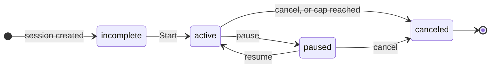

A Subscription is one customer's meter on one Product. It is created when a subscriber presses Start on a Checkout session, and it ends when someone cancels or the cap is reached.

## States



| `status` | Meaning | Event |
| --- | --- | --- |
| `incomplete` | Session created, subscriber has not pressed Start. | — |
| `active` | The meter is running. | `subscription.created` |
| `paused` | Stopped without ending; no seconds accrue. Only Products with `allow_pause` can pause. | `subscription.updated` |
| `canceled` | Ended. Totals are final. `ended_reason` is `canceled` or `cap_reached`. | `subscription.canceled` |

There is no `past_due`. If a settlement cannot be paid, you receive `invoice.payment_failed` and the meter stops.

## The arithmetic

Billing is whole seconds times the rate, in USD, as decimal strings. Nothing is prorated and nothing is rounded up to a period.

```text
rate_usd_per_second   0.004
seconds_elapsed       83
amount_settled        0.332        (shown to the subscriber as $0.33)
```

`seconds_elapsed` excludes paused time. Settlement happens in batches while the meter runs and once more at cancel, so an Invoice may arrive mid-run; the Subscription's `settled_usd` and `seconds_elapsed` are always cumulative. On cancel, whatever the subscriber funded but did not use goes back to them.

## Cancel from your server

A merchant-initiated cancel behaves exactly like the subscriber pressing the button: the meter stops at that second and unspent funds are returned. Use it when their session in your product ends, or when you revoke access for your own reasons.

<CodeGroup>
```ts TypeScript
const sub = await elapse.subscriptions.cancel("sub_…");
// sub.status is still "active" here; the chain confirms in about a second and
// subscription.canceled arrives at your webhook with the final totals.
```
```bash cURL
curl -X POST "$ELAPSE_API_URL/v1/subscriptions/sub_…/cancel" \
  -H "Authorization: Bearer $ELAPSE_SECRET_KEY"
```
</CodeGroup>

The call answers `202`. Treat the webhook as the truth, not the response.

## Who pauses, who stops

**Pausing is yours, stopping is theirs.** A subscriber cannot pause a meter — a paused meter costs them nothing while your resource stays allocated, so only you can, with `subscriptions.pause`. Stopping is different: it returns their unused escrow and your resource together, so a subscriber may stop any meter they started (a merchant-started one is yours to stop too).

In your own page, `<Meter>` from `@elapse/react` shows the counter and Stop. Pass `onPauseRequest` and `onResumeRequest` and it also shows Pause and Resume as **requests to you**: the button calls your handler, nothing is signed, and your server decides and calls `subscriptions.pause`. Every Subscription also carries `manage_url`, the subscriber's own page of meters and receipts across merchants — put that where you would put "Manage subscription".

<CodeGroup>
```ts TypeScript
const sub = await elapse.subscriptions.retrieve("sub_…");
// <a href={sub.manage_url}>Manage your meter</a>
```
```bash cURL
curl "$ELAPSE_API_URL/v1/subscriptions/sub_…" \
  -H "Authorization: Bearer $ELAPSE_SECRET_KEY" | jq -r .manage_url
```
</CodeGroup>

Webhooks tell you either way: `subscription.canceled` when a subscriber stops, and `subscription.updated` when a pause or resume of your own confirms on chain. A stopped meter is final. To bill them again, create a new Checkout session.

## Build the meter in your own product

Elapse hosts the checkout. Everything after that can live in your UI, with three calls and no polling.

<CodeGroup>
```ts TypeScript
// 1. Which of this customer's meters are running?
const { data } = await elapse.subscriptions.list({ customer: "cus_…", status: "active" });

// 2. What you need to draw a counter.
const sub = await elapse.subscriptions.retrieve(data[0].id);
const rate = sub.rate_usd_per_second;   // "0.004", keep it a string
const startedAt = sub.started_at;       // unix seconds

// 3. Tick on the client: elapsed = now − started_at; accrued = elapsed × rate.
//    Use integer micro-dollars or a decimal library for the display math.

// 4. Your own Cancel button.
await elapse.subscriptions.cancel(sub.id);
```
```bash cURL
curl "$ELAPSE_API_URL/v1/subscriptions?customer=cus_…&status=active" \
  -H "Authorization: Bearer $ELAPSE_SECRET_KEY"

curl "$ELAPSE_API_URL/v1/subscriptions/sub_…" \
  -H "Authorization: Bearer $ELAPSE_SECRET_KEY"

curl -X POST "$ELAPSE_API_URL/v1/subscriptions/sub_…/cancel" \
  -H "Authorization: Bearer $ELAPSE_SECRET_KEY"
```
</CodeGroup>

Two things to know:

- **Never poll for the amount.** The counter is `rate × (now − started_at)`, computed where it is displayed. The server does not have a fresher number, because accrual is continuous.
- **The subscriber account page is optional.** Elapse offers subscribers one page that lists every meter they have running, across merchants, under the Elapse name. You can link to it or ignore it. It is never branded as yours.
